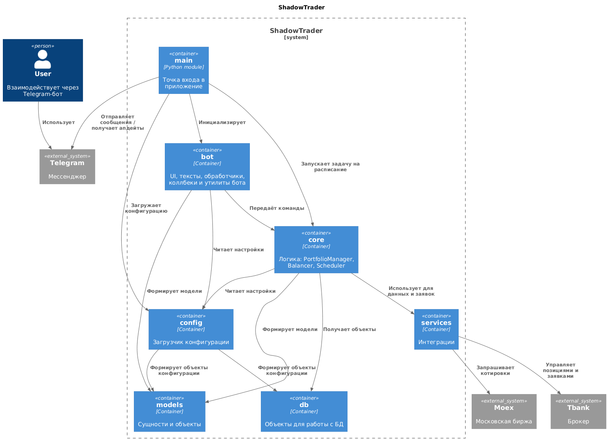

# ShadowTrader

Данный репозиторий представляет собой код бота, который предоставляет возможность сделать ребаласировку портфеля. 
Ребалансировка производится по принципу повторения структуры одного из индексов Московской биржи.

> **⚠️ Warning**
> 
> На текущий момент в качестве брокера может быть только Т-банк.

## Начало работы
Для запуска бота потребуется сделать копию файла конфигурации:
```commandline
cp dev.toml-example prod.toml
```
Заполните файл конфигурации. Обязательные поля для заполнения:
* `telegram.token` - токен вашего бота в телеграм
* `broker.token` - токен для работы с портфелем в Т-банке 
([подробнее](https://developer.tbank.ru/invest/intro/intro/token]))
* `telegram.telegram_id` - идентификатор вашего аккаунта в телеграм. Необходимо, чтобы был доступ только у вас.

Блоки `users.links` и `users.schedule` - приведены для примера, их нужно удалить.
Остальные параметры можно оставить как есть

Соберите образ контейнера и запутсите:
```commandline
docker build -t shadowtrader:latest .
docker run --rm -it   -v $(pwd)/prod.toml:/prod.toml   shadowtrader:latest
```

## Текущая архитектура



## Как пользоваться

