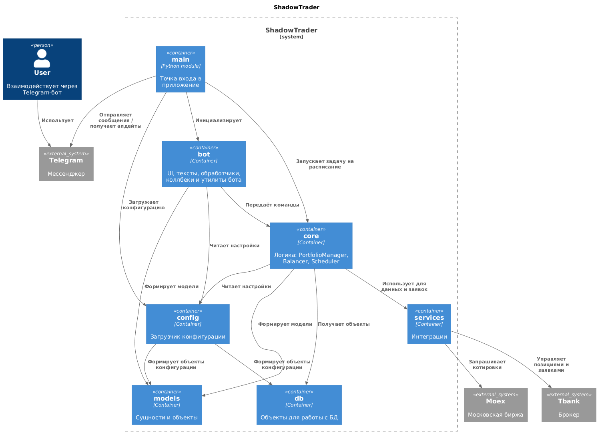

# ShadowTrader

Данный репозиторий представляет собой код бота, который предоставляет возможность сделать ребаласировку портфеля. 
Ребалансировка производится по принципу повторения структуры одного из индексов Московской биржи.

> **⚠️ Warning**
> 
> На текущий момент в качестве брокера может быть только Т-банк.

## Начало работы
### 1. Скачайте файлы требующиеся для запуска образа
Для запуска бота потребуется сделать файла конфигурации и файл с переменными окружения. Для это стянем примеры из репы:
```commandline
wget -O prod.toml https://raw.githubusercontent.com/LevBaranov/ShadowTrader/refs/heads/master/prod.toml-example
wget -O .env https://raw.githubusercontent.com/LevBaranov/ShadowTrader/refs/heads/master/.env-example
```
Также потребуется `docker-compose.yaml`
```commandline
wget -O docker-compose.yaml https://raw.githubusercontent.com/LevBaranov/ShadowTrader/refs/heads/master/docker-compose.yaml
```
### 2. Сформируйте свою конфигурацию и переменные окружения
Заполните файл конфигурации `prod.toml`. Обязательные поля для заполнения:
* `telegram.token` - токен вашего бота в телеграм
* `broker.token` - токен для работы с портфелем в Т-банке 
([подробнее](https://developer.tbank.ru/invest/intro/intro/token]))
* `users[].telegram_id` - идентификатор вашего аккаунта в телеграм. Необходимо, чтобы был доступ только у вас.

Остальные параметры можно оставить как есть
> **⚠️ Warning**
> 
> В процессе работы появятся блоки `users.index_bindings` и `users.schedule` их трогать не надо. Управление этими 
> блоками через бота.
> 
> В версиях 0.2.0 и ниже создавалась связка links. В версиях выше в конфигурации эта сущность имеет имя index_bindings

Заполните в `.env` свои данные для доступа к БД. Не забудьте продублировать их в `docker-compose.yaml`

### 3. Создайте директорию для логов
Создайте директорию для логов и результатов выполненных по расписанию.
```commandline
mkdir scheduler_results
mkdir logs
```
### 4. Запуск
Запустите контейнеры:
```commandline
docker compose up -d
```

## Текущая архитектура



## Как пользоваться

При первом запуске бот предложит выполнить настройки (их можно будет изменить позднее при необходимости), просто 
следуйте инструкции бота по шагам. После того как вы настроите связку вашего аккаунта у брокера и индекса Мосбиржи вам
нужно сделать ребалансировку. Бот сам рассчитает какие бумаги и сколько нужно приобрести или продать, вам следует только
прислушаться к его советам.

> **⚠️ Warning**
> 
> На текущий момент нельзя выбрать определённые действия, можно только безоговорочно согласится с предложениями бота. 

Для автоматической балансировки необходимо, чтобы было настроено расписание, как часто выполнять балансировку. Возможны 
варианты: раз неделю, 30 дней и квартал. Для срабатывания балансировки необходимо? чтобы с момента прошлой балансировки
прошёл указанный интервал, а также на балансе портфеля должно быть больше чем указано в `balancer.max_cash` в вашем 
конфиге (`prod.toml`). Если условие не будет выполнено, то повторная проверка выполнения условий будет через время
указанное в `scheduler.timeout_in_sec` в вашем конфиге(`prod.toml`). 