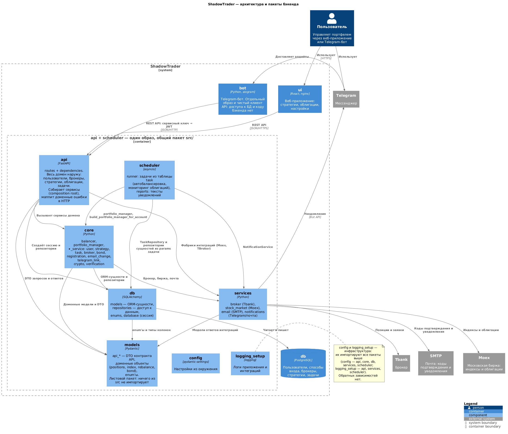

# ShadowTrader

Сервис для ведения портфеля по принципу повторения структуры одного из индексов
Московской биржи. Интерфейсы — веб-приложение и Telegram-бот, оба работают через
общий REST API.

> **⚠️ Warning**
>
> На текущий момент в качестве брокера может быть только Т-банк.

## Архитектура

Сервис состоит из контейнеров:

* `db` — PostgreSQL;
* `migrations` — разовый прогон alembic-миграций;
* `api` — FastAPI-бэкенд (весь домен: пользователи, брокеры, стратегии, задачи);
* `ui` — веб-приложение (React);
* `bot` — Telegram-бот. Отдельный сервис в каталоге `bot/` со своим образом
  (`bot.Dockerfile`, контекст сборки — только `bot/`) и своими зависимостями
  (`bot/requirements.txt`). Чистый клиент API: обменивает сервисный ключ +
  telegram_id на короткоживущий JWT (`/service/telegram/token`) и дальше ходит в
  обычные эндпоинты. Доступа к БД и коду бэкенда у бота нет — это проверяется
  тестом `bot/tests/test_no_backend_imports.py`;
* `scheduler` — планировщик: исполняет задачи из БД (автобалансировка,
  мониторинг оферт по облигациям) и уведомляет пользователей в Telegram или на почту.

Контейнеры `api` и `scheduler` собираются из одного образа и делят пакет `src/` —
на диаграмме они раскрыты до пакетов (`core`, `services`, `db`, `models`,
`config`); между пакетами направление стрелок = направление импорта, циклов нет.



## Способы входа

Учётная запись не привязана к конкретному каналу — способы входа хранятся отдельно
(таблица `auth_identities`), их может быть несколько:

* **почта + пароль** — регистрация в веб-приложении с подтверждением почты кодом;
* **Telegram** — регистрация прямо в боте (`/start` → «Зарегистрироваться»), без почты;
* привязка Telegram к существующей веб-учётке — бот даёт ссылку
  `{WEB_APP_URL}/link-telegram?code=…`, привязка подтверждается в вебе.

## Начало работы

### 1. Скачайте файлы, требующиеся для запуска

```commandline
wget -O .env https://raw.githubusercontent.com/LevBaranov/ShadowTrader/refs/heads/master/.env-example
wget -O docker-compose.yaml https://raw.githubusercontent.com/LevBaranov/ShadowTrader/refs/heads/master/docker-compose.yaml
```

### 2. Заполните переменные окружения (`.env`)

Суть переменных:

* данные БД (`DB_*`);
* `SECRET_KEY`, `JWT_ISSUER`, `JWT_AUDIENCE` — JWT;
* `TOKEN_ENCRYPTION_KEY` — шифрование брокерских токенов в БД;
* `TELEGRAM_BOT_TOKEN` — токен бота (BotFather); нужен боту и планировщику;
* `BOT_API_KEY` — сервисный ключ бота (`python -c "import secrets; print(secrets.token_urlsafe(48))"`);
* `WEB_APP_URL` — публичный адрес веб-приложения (для диплинка привязки).
* `SMTP_*` (письма подтверждения почты и уведомления),
* `SCHEDULER_INTERVAL_SEC` (период планировщика, по умолчанию 300 сек),
* `MOEX_*` (адрес ISS Мосбиржи),
* `LOG_*` (логи).

Других источников конфигурации нет: инфраструктура — в `.env`, всё
пользовательское — в БД. 

### 3. Запуск

```commandline
docker compose up -d
```

## Как пользоваться

Веб-приложение и бот — два независимых и равнозначных интерфейса: всё, что можно
сделать в одном, доступно и в другом.

1. Зарегистрируйтесь: в веб-приложении (почта + код подтверждения) или прямо в боте.
2. Подключите брокера (API-токен Т-банка,
   [подробнее](https://developer.tbank.ru/invest/intro/intro/token)).
3. Создайте стратегию: выберите счёт и индекс Мосбиржи.
4. Балансируйте портфель вручную (перед исполнением показывается план действий)
   или включите автобалансировку по расписанию: раз в неделю / 30 дней / квартал.

Автобалансировка срабатывает, когда с прошлого запуска прошёл выбранный интервал
и свободных средств на счёте больше порога, заданного в расписании
(«Запускать от суммы»). Отчёт о выполненных действиях приходит по выбранному
каналу уведомлений.

### Настройки пользователя

«Настройки» и карточка стратегии в БД:

| настройка                     | где                            | что делает                                                                   |
|-------------------------------|--------------------------------|------------------------------------------------------------------------------|
| Комиссия по тарифу            | Настройки → Брокеры и счета    | учитывается в расчёте балансировки (`users_broker.commission`)                |
| Неснижаемый остаток           | карточка стратегии → ⚙         | сумма, которую балансировка не тратит на покупки (`users_strategy.max_cash`)  |
| Отклонение от индекса         | карточка стратегии → ⚙         | пока вес бумаги ближе к индексу, её не трогаем (`users_strategy.delta`)       |
| Минимум лотов к сохранению    | карточка стратегии → ⚙         | сколько лотов оставить при продаже (`users_strategy.min_lots_to_keep`)        |
| Запускать от суммы            | расписание стратегии           | порог свободного кэша для автобалансировки (`task.params.min_free_cash`)      |
| Канал уведомлений             | Настройки → Уведомления        | Telegram, почта или оба (`users.notification_channel`)                       |

Канал уведомлений можно выбрать только при наличии соответствующего способа
входа; если выбранный канал стал недоступен (например, Telegram отвязали),
уведомление уйдёт на оставшийся.

### Облигации

Раздел «Облигации» не связан со стратегиями:

1. выберите любой свой счёт у брокера;
2. сервис покажет облигации на этом счёте, по которым впереди **оферта** или
   **колл-опцион**, с датой каждого события;
3. кнопка «Сообщить о событии» создаёт задачу `BOND_EVENTS_MONITOR` — планировщик
   раз в неделю проверяет счёт и пишет, когда до события останется меньше двух недель.

### Настройки

Задачи по расписанию (автобалансировка, мониторинг облигаций) видны и отключаются
в настройках. Там же — обновление списка счетов, подключение брокера и замена его
токена, смена почты с подтверждением кодом, привязка и отвязка Telegram.

## Логи

Все обращения к внешним сервисам (брокер, Мосбиржа, почта, Telegram, а у бота —
бэкенд) логируются одинаково: одна строка на вызов — что вызвали, чем
закончилось, сколько заняло и минимум параметров.

```
2026-08-03 12:00:01 | INFO  | integration.broker   | create_order | ok      | 118ms | account=2000000001 ticker=SBER type=BUY quantity=2
2026-08-03 12:00:02 | ERROR | integration.moex     | get_bonds    | error   | 934ms | url=https://iss.moex.com/… error=Error: Moex: Code: 503
2026-08-03 12:00:03 | INFO  | integration.telegram | send_message | skipped | 0ms   | chat_id=123456789 reason=bot_token_not_configured
```

Каталог логов монтируется на хост — по подкаталогу на сервис, чтобы процессы не
писали в один файл:

```
logs/
├── api/        app.log, broker.log, moex.log, email.log, telegram.log
├── scheduler/  app.log, broker.log, moex.log, email.log, telegram.log
└── bot/        bot.log, api.log
```

`app.log`/`bot.log` — общий лог процесса (то же уходит в stdout, то есть в
`docker compose logs`), остальные файлы — по одному на интеграцию, с ротацией
по 5 МБ (3 файла в архиве). Токены, пароли и ключи в лог не попадают — ни в
параметрах, ни в телах ответов.

Настройки — только переменные окружения (полезно, когда нужен разбор инцидента
без пересборки):

| env           | по умолчанию | назначение                                     |
|---------------|--------------|------------------------------------------------|
| `LOG_ENABLED` | `1`          | писать ли файлы (в stdout лог идёт всегда)     |
| `LOG_PATH`    | `logs`       | каталог логов (в докере — `/app/logs`)         |
| `LOG_VERBOSE` | `0`          | добавить к каждому вызову запрос/ответ целиком  |
| `LOG_LEVEL`   | `INFO`       | уровень общего лога                            |

Подробный режим включается на один сервис и не требует пересборки:

```commandline
docker compose run --rm -e LOG_VERBOSE=1 scheduler python -m src.scheduler.main
```

Относительный `path` считается от корня проекта, а не от каталога запуска, —
поэтому `logs/` не появляется внутри пакетов с кодом (`src/…`) и рядом с тестами.

## Разработка

```commandline
docker compose -f docker-compose.dev.yaml up -d   # весь стек локально
```

Тесты (бэкенд и бот запускаются одной командой, зависимости бота — в
`bot/requirements-dev.txt`):

```commandline
pytest
```

Сборка образов вручную:

```commandline
docker build -f backend.Dockerfile -t shadowtrader-back .
docker build -f bot.Dockerfile     -t shadowtrader-bot  ./bot
docker build -f frontend.Dockerfile --target prod -t shadowtrader-ui .
```
